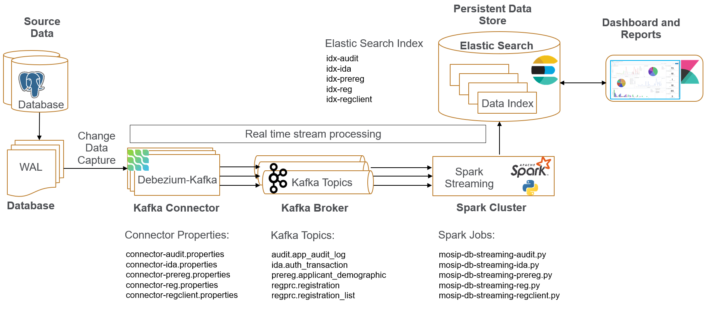
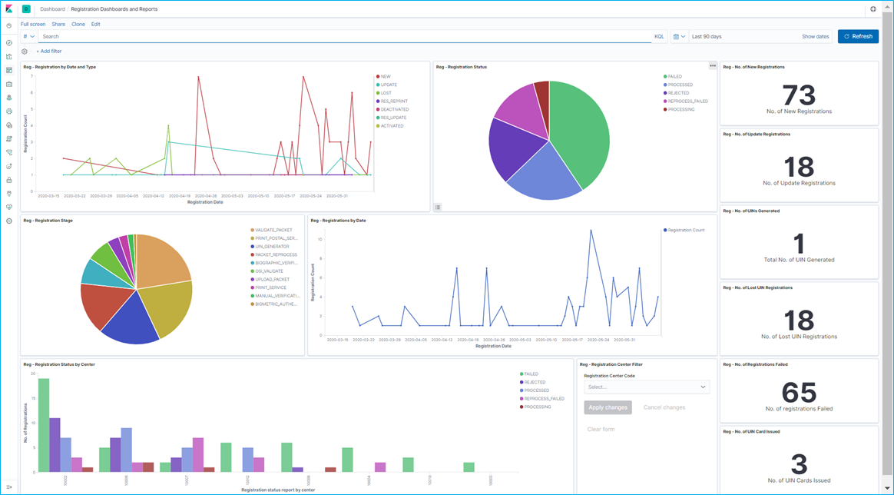

### 1.	Introduction - Reference Reporting Framework
Document is to present the MOSIP reference reporting requirement and reporting framework with system design and implementation. MOSIP as a platform is designed and developed to issue identity for individuals in the country. MOSIP platform has many modules and many running components within the modules which will generate system data, seed data and transaction data. Reporting and analytics required to generate on data available in MOSIP system to monitor the operational consistency in the system periodically

Reporting framework uses below tool for batch processing and real-time streaming data processing, indexing in to persistant data store and visualization.

#### Batch data processing, Persistant Store and Visualisation

##### * Logstash is part of elastic stack and used to crawl data from database transform and index to elastic search (Batch processing). Logstash is not required if Debezium, Kafka and spark used (real-time processing).
##### * Elastic search as data-index and persistence store
##### * Kibana as visualization to create and view dashboards and reports. Reference dashboards and reports are provided as part of this deployment.

#### Real time stream data processing, Persistant Store and Visualisation

##### * Postgres for MOSIP data source enabled with binary or write ahead logs
##### * Debezium for change data capture from postgres, This is used along with Kafka connect as plugin
##### * Kafka connect to connect data source and stream data
##### * Kafka server for message broaker which will stream data from kafka connect
##### * Zookepere for Kafka broakers co-ordination of the jobs
##### * Spark streaming to process the data received from kafka topic in real-time
##### * Spark uses pyspark for data processing and processing job are written in python.
##### * Elastic search as data-index and persistence store
##### * Kibana as visualization to create and view dashboards and reports. Reference dashboards and reports are provided as part of this deployment.

   

### 1.	Reference Reports / Dashboards
#### a.	Pre Registration Reports
		Total No. of pre registrations application created per day/month/overall
		No. of pre registrations consumed per day/month/overall
		No. of pre registrations expired per day/month/overall
		No. of pre registration Pending Appointments per day/month/overall
		No of pre registration Appointments Booked per day/month/overall

 

#### b.	Registration Report at Center Level
		Total number of registrations attempted
		Total number of registrations attempted by registration center
		No. of registration approved
		No. EOD registration rejection report by supervisor with reasons
		Registration status report by Center

 

#### b.	Registration Report at Processing
		No. of new registrations per day/month/overall
		No. of update registration per day/month/overall
		No. of lost UIN registration per day/month/overall
		Total number of UINs generated per day/month/overall
		Total number of UINs generated by center per day/month/overall
		Number of UIN cards issued per day/month/overall
		Registration status report by center 
		No. of registration failed per day/month/overall

 

#### b.	Authentication Reports
		No. of authentication done per day/month/overall
		No. of authentication failures per day/month/overall
		No. of authentication by type per day/month/overall
		No. of internal authentication per day/month/overall
		No. of partner authentication per day/month/overall 

 

#### b.	Search and Export reports to CSV

 

		
