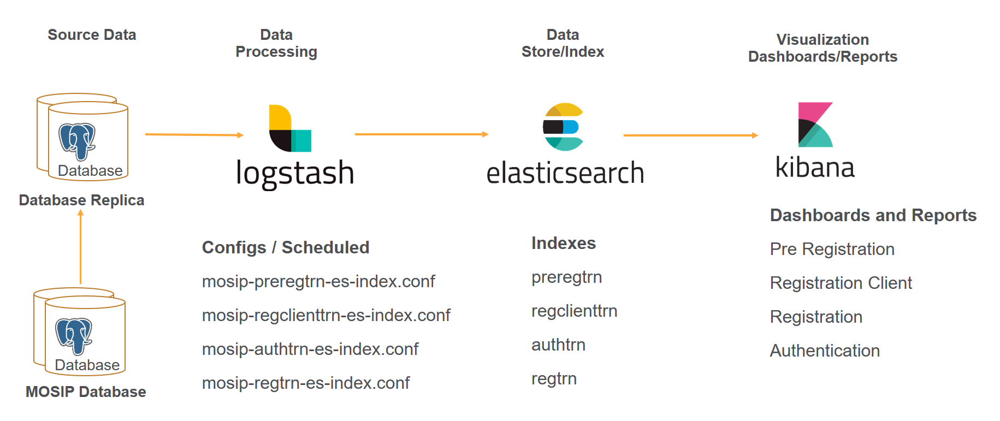
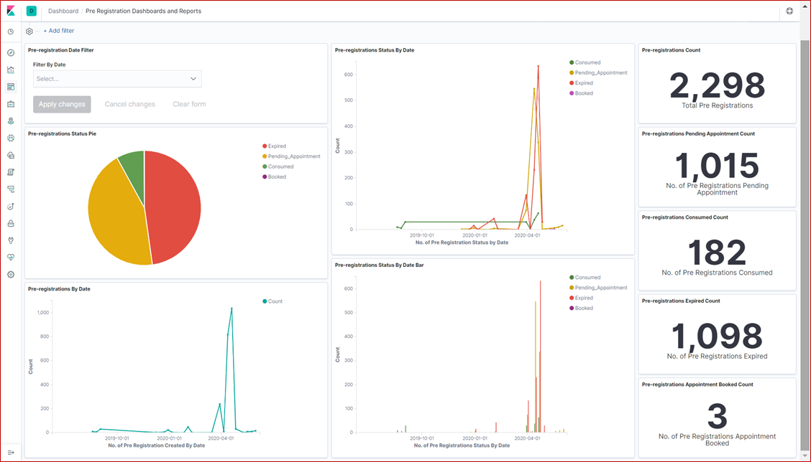
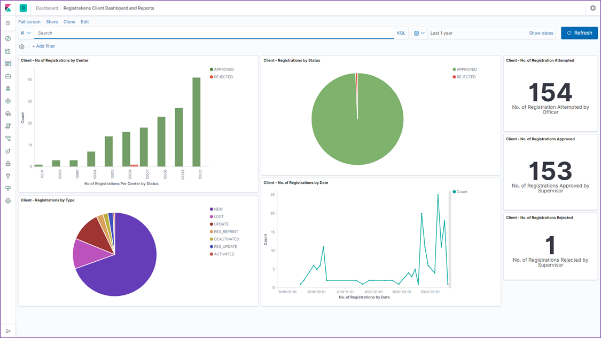
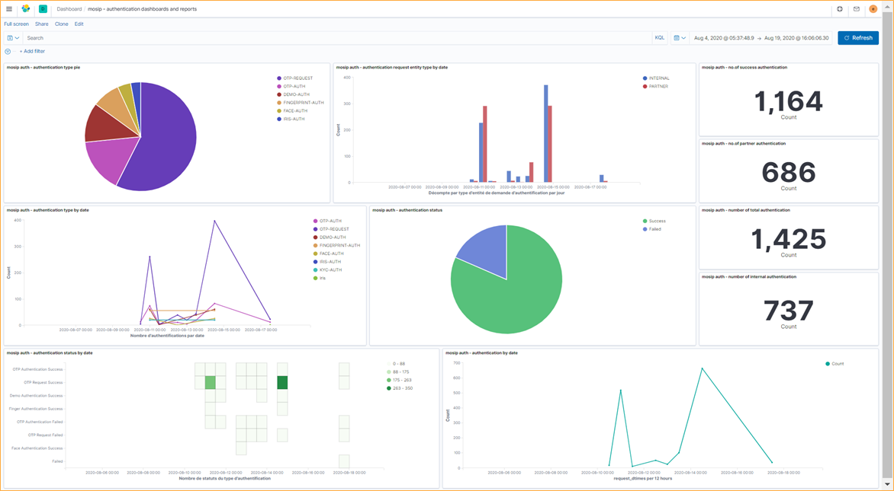

### 1.	Introduction - Reference Reporting Framework
Document is to present the MOSIP reference reporting requirement and reporting framework with system design and implementation. MOSIP as a platform is designed and developed to issue identity for individuals in the country. MOSIP platform has many modules and many running components within the modules which will generate system data, seed data and transaction data. Reporting and analytics required to generate on data available in MOSIP system to monitor the operational consistency in the system periodically

Reporting framework uses below tool for batch processing and real-time streaming data processing, indexing in to persistant data store and visualization.

#### Batch data processing, Persistant Store and Visualisation

##### * Postgres for MOSIP data source enabled with read-replicas for reporting purpose
##### * Logstash is part of elastic stack and used to crawl data from database transform and index to elastic search (Batch processing). Logstash is not required if Debezium, Kafka and spark used (real-time processing).
##### * Elastic search as data-index and persistence store
##### * Kibana as visualization to create and view dashboards and reports. Reference dashboards and reports are provided as part of this deployment.

#### Real time stream data processing, Persistant Store and Visualisation

##### * Postgres for MOSIP data source enabled with binary or write ahead logs
##### * Debezium for change data capture from postgres, This is used along with Kafka connect as plugin
##### * Kafka connect to connect data source and stream data
##### * Kafka server for message broaker which will stream data from kafka connect
##### * Zookepere for Kafka broakers co-ordination of the jobs
##### * Spark streaming to process the data received from kafka topic in real-time
##### * Spark uses pyspark for data processing and processing job are written in python.
##### * Elastic search as data-index and persistence store
##### * Kibana as visualization to create and view dashboards and reports. Reference dashboards and reports are provided as part of this deployment.

   

### 1.	Reference Reports / Dashboards
#### a.	Pre Registration Reports
Pre Registration is the module in mosip used for residents to pre-register themselves for registration to get the ID. Resident can login to application and provide required information, upload required document and book an appointment for the registration with convenient registration center. During the process of pre-registration individuals go through may steps by providing details and all the steps are captured by system with proper status of each pre-registration. Reporting system will capture the details and created to provide below reference reports.

##### * Total No. of pre registrations application created per day/month/overall
##### * No. of pre registrations consumed per day/month/overall
##### * No. of pre registrations expired per day/month/overall
##### * No. of pre registration Pending Appointments per day/month/overall
##### * No of pre registration Appointments Booked per day/month/overall

 

#### b.	Registration Report at Center Level
The registration client is a thick Java-based client where the resident's demographic and biometric details are captured along with the supporting documents in online or offline mode.   The captured information is packaged in a secure tamper-proof way and send to the server for processing. During registration process all the stage and activity data is captured with proper registration status. Reporting system will capture the details and created to provide below reference reports.

##### * Total number of registrations attempted
##### * Total number of registrations attempted by registration center
##### * No. of registration approved
##### * No. EOD registration rejection report by supervisor with reasons
##### * Registration status report by Center

 

#### c.	Registration Report at Processing
Registration Processor processes the data (demographic and biometric) of an Individual for quality and uniqueness and then issues a Unique Identification Number (UIN). It also provides functionality to update demographic and biometric data and issue a new UIN if lost.  The source of data are primarily from MOSIP Registration Client, Existing ID system(s) of a country and Processor transaction data. Reporting system will capture the details and created to provide below reference reports.

##### * No. of new registrations per day/month/overall
##### * No. of update registration per day/month/overall
##### * No. of lost UIN registration per day/month/overall
##### * Total number of UINs generated per day/month/overall
##### * Total number of UINs generated by center per day/month/overall
##### * Number of UIN cards issued per day/month/overall
##### * Registration status report by center 
##### * No. of registration failed per day/month/overall

 

#### d.	Authentication Reports
ID Authentication provides an API based authentication mechanism for entities to validate individuals. ID Authentication is the primary mode for entities to validate an individual before providing any service.Following are the pre-requisites for an entity to do authentication of an individual
* ID Authentication requests must come to MOSIP only via trusted parties who are white listed in MOSIP. The trusted parties are referred to as partners in MOSIP.
* The biometric devices used for authentication must be registered with MOSIP.
All the authentication request and response details captured and used for auditing and reporting. Reporting system will capture the details and created to provide below reference reports.

##### * No. of authentication done per day/month/overall
##### * No. of authentication failures per day/month/overall
##### * No. of authentication by type per day/month/overall
##### * No. of internal authentication per day/month/overall
##### * No. of partner authentication per day/month/overall 

 

#### e.	Search and Export reports to CSV
Reporting framework and visualisation tool will provide flexibility to create the reports required by the country and export those reports as CSV format. This reports can be configured, pre viewed and saved for future view and updates. Exported CSV reports can be shared with other users as required.

 

		
