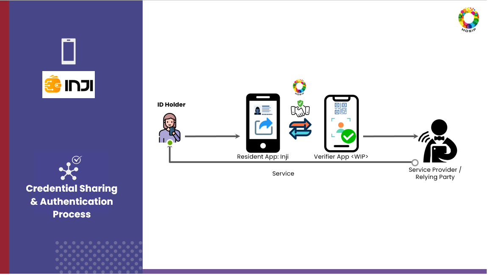
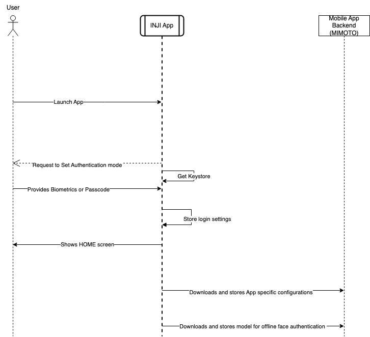
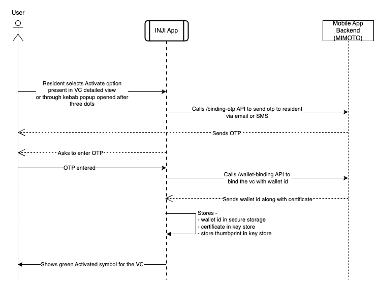
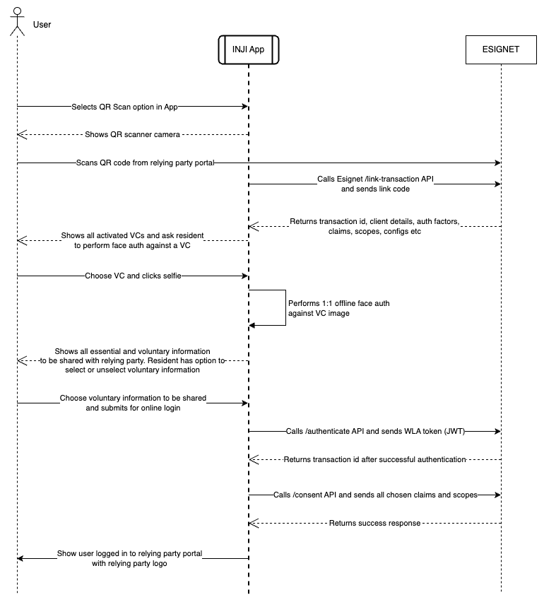

# Overview

Inji is a secure, trusted and reliable mobile wallet and authenticator that can be used by residents to -
- securely download and store digital credentials into wallet.
- perform offline face authentication against own digital credential to verify user presence.
- share digital credential with relying parties to avail services
- perform online login to a relying party portal by scanning qr code to avail services.

Additionally, it can be used as a base to create a verifier App by service providers to authenticate the resident identity in order to provide services.

The app is built using [react native framework](https://reactnative.dev/) which supports both Android and iOS mobile operating systems. It uses [xstate state machines](https://xstate.js.org/docs/) to manage the application state. The digital credentials generated by the mobile application follow the Verifiable Credentials(**VC**) data model. To learn more, read [Verifiable Credentials Data Model](https://www.w3.org/TR/vc-data-model/).

After installing the App, resident can enter the unique id(issued by country, ex - UIN or VID) on the app to generate VC. Resident will be prompted to enter the OTP sent on registered mobile number or email address. After successful validation VC will be downloaded and stored on the app.
Resident can also use application id if UIN or VID is not available. The resident can then share the download VC with the relying party via bluetooth to avail services. The app uses [ble protocol]() to share VC.

Inji also supports integration with [esignet](https://docs.esignet.io/) where resident can login to the relying party portal by scanning a qr code. Resident can also choose what information to be shared with the relying party. Resident has to activate vc before performing online login.

Inji will have upcoming support of ussd code for feature phone users as well as Open id standard issuance and [OWF architecture](https://github.com/openwallet-foundation).

Below diagram shows how credential share and authentication process takes place between resident and service provider.

#### Backend 
- The app uses [Mimoto APIs](https://mosip.stoplight.io/docs/mimoto) for generating VCs, downloading and activation.
- It uses [Esignet APIs](https://mosip.stoplight.io/docs/identity-provider) for online login.

# Installing the application
After installing the application, the user will need to set an app lock code for it. App supports biometric or PIN based lock. For more details, refer the [User Guide]().

# Generating and storing of credentials
A resident can generate a Verifiable Credential(VC) for them or their family or friends on the same phone.
Detailed steps on generating and sharing credentials are given in the [user guide]().
The process of generating a credential is shown below

# Sharing of credentials
The credentials are shared in peer-to-peer model with verifier application. The data exchange between devices is done using BLE Protocol. Refer to [Tuvali documentation]() for more info.

# Online Login Process
Resident can use INJI app to login to any service provider app(integrated with esignet) just by scanning a qr code from their portal. 
The app performs offline face auth after scanning qr code to verify user presence. 
Once presence is verified, resident is given option to choose what optional information to be shared with service provider portal.
After consent App sends a WLA(Wallet local auth) token which is a JWT token to the relying party. 
The resident is given access to the portal after token verification.

#### Step 1: VC activation process

#### Step 2: Online QR Login
